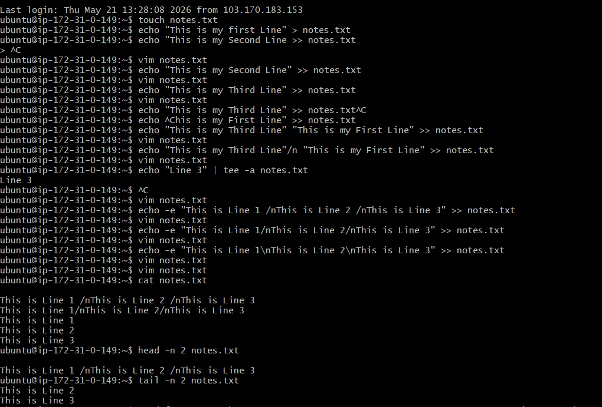
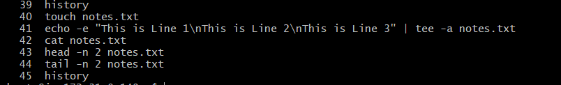

# Day 06 – Linux Fundamentals: Read and Write Text Files

1. **Create a file**

- touch notes.txt

2. Write 3 lines into the file using redirection(> and >>)

- echo -e "This is Line 1\nThis is Line 2\nThis is Line 3" | tee -a notes.txt

3. Use cat to read the full file

- cat notes.txt

4. Use head and tail to read parts of the file

- head -n 2 notes.txt
- tail -n 2 notes.txt

## Screenshot

