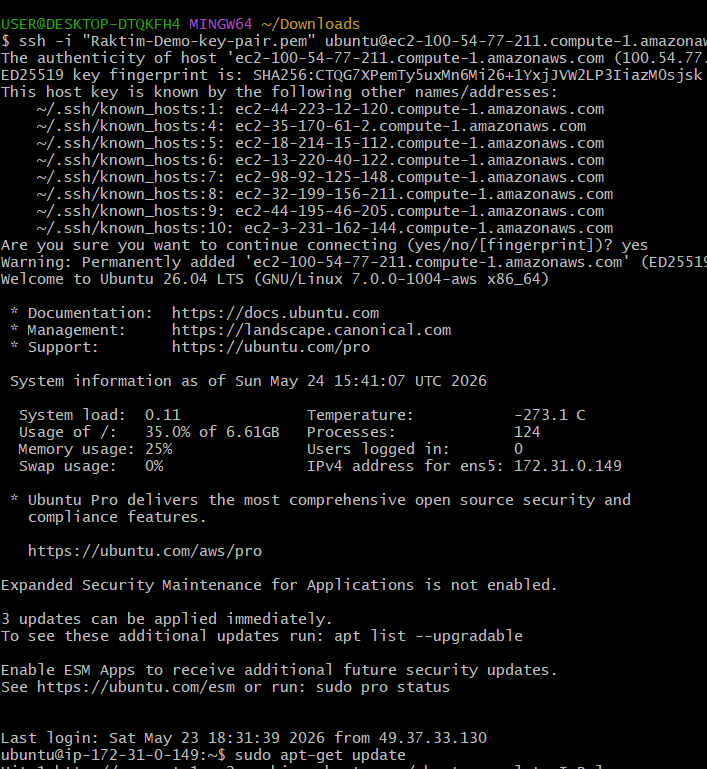
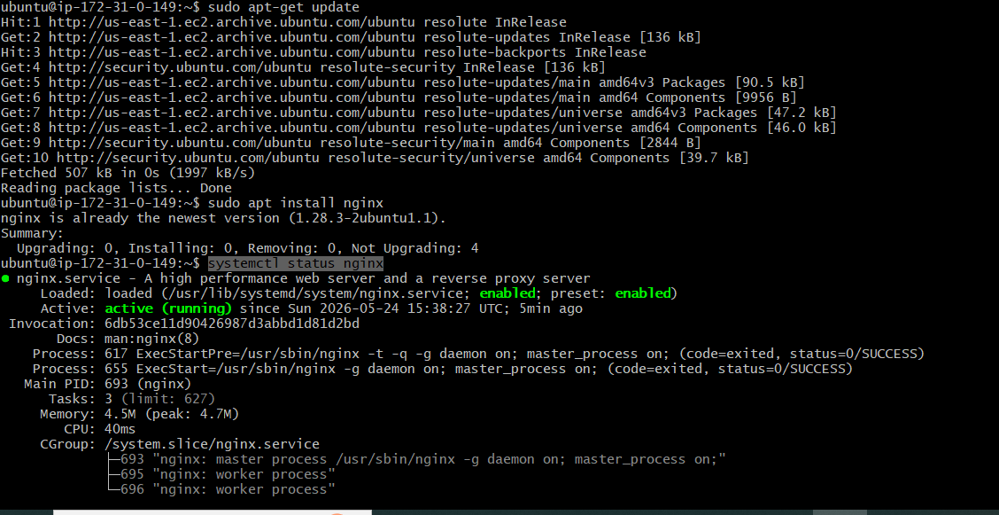
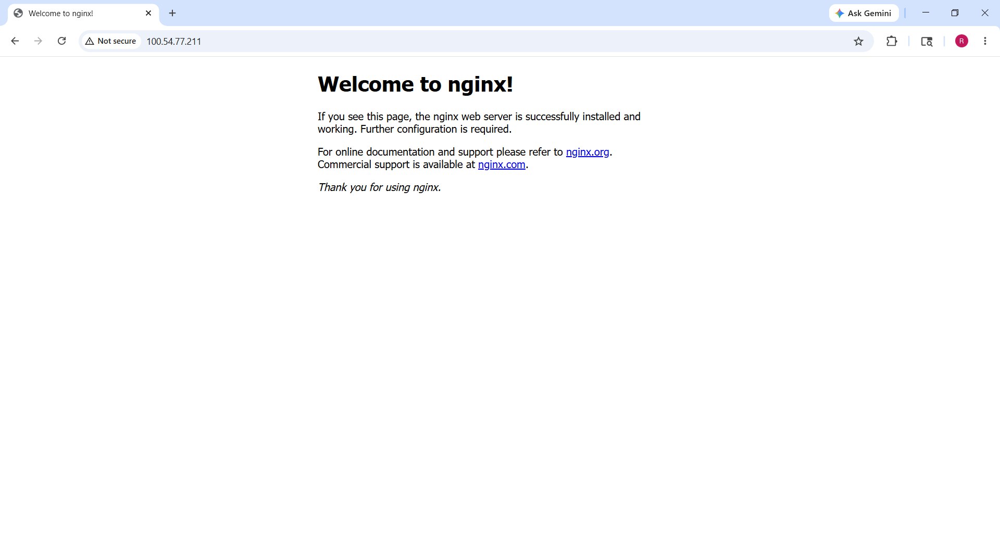
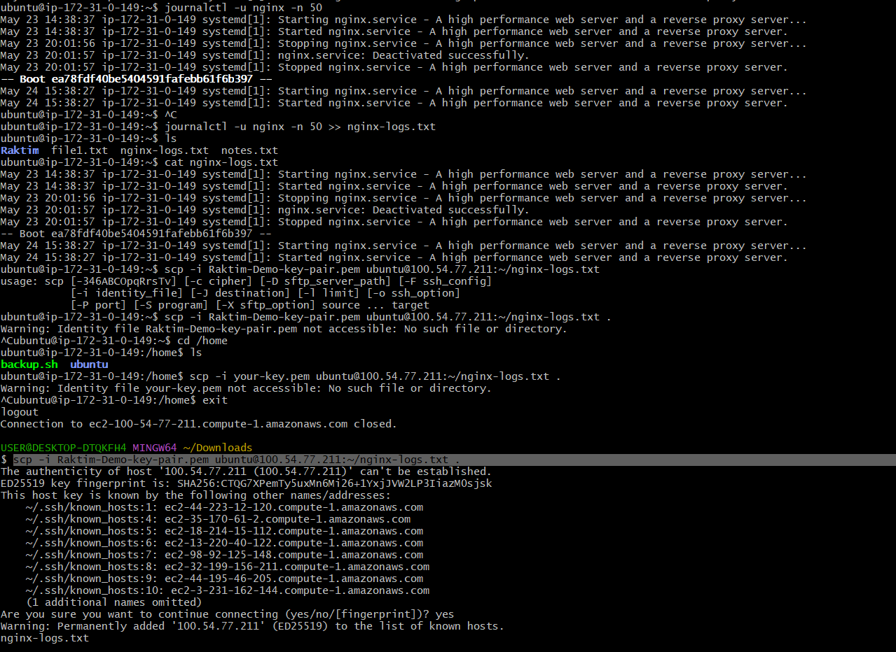

# Day 08 – Cloud Server Setup: Docker, Nginx & Web Deployment

**Part 1: Launch Cloud Instance & SSH Access**

- Successfully connected to ssh

**Part 2: Install Docker & Nginx**

**Step 1: Update System**

- sudo apt-get update

**Step 2: Install Nginx**

- sudo apt install nginx

**Verify Nginx is running:**

- systemctl status nginx

**Part 3: Security Group Configuration**

**Part 4: Extract Nginx Logs**

**Step 1: View Nginx Logs**

- journalctl -u nginx -n 50

**Step 2: Save Logs to File**

- journalctl -u nginx -n 50 >> nginx-logs.txt

**Step 3: Download Log File to Your Local Machine**

- scp -i Raktim-Demo-key-pair.pem ubuntu@100.54.77.211:~/nginx-logs.txt .
(Note: Exit from remote server then run this command.)

