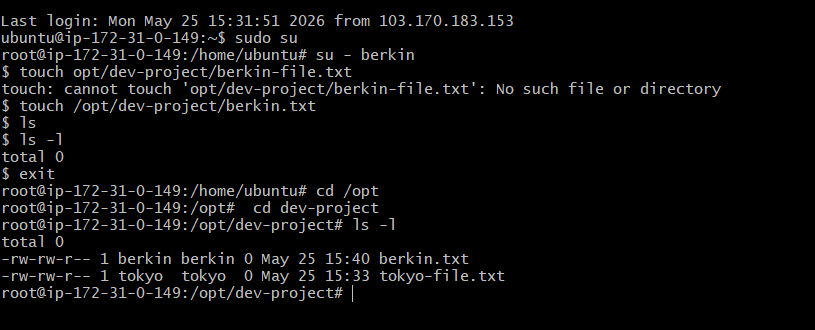
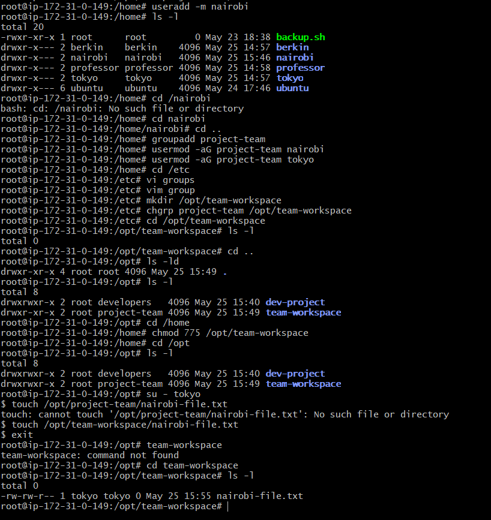

# Day 09 – Linux User & Group Management Challenge

## Task

### Task 1: Create Users

- useradd -m tokyo
- useradd -m berkin
- useradd -m professor

### Task 2: Create Groups

- groupadd developers
- groupadd admins

### Task 3: Assign to Groups

- usermod -aG developers tokyo
- usermod -aG developers berkin
- usermod -aG admins berkin
- usermod -aG admins professor

**To check group membership**

- groups tokyo
- groups berkin
- groups professor

### Task 4: Shared Directory

- mkdir /opt/dev-project
- chgrp developers /opt/dev-project
- chmod 775 /opt/dev-project
- su - tokyo
- touch /opt/dev-project/tokyo-file.txt
- su - berkin
touch /opt/dev-project/berkin-file.txt

### Task 5: Team Workspace

-  useradd -m nairobi
-  groupadd project-team
- usermod -aG project-team nairobi
- usermod -aG project-team tokyo
- mkdir /opt/team-workspace
- chgrp project-team /opt/team-workspace
- chmod 775 /opt/team-workspace
- touch /opt/team-workspace/nairobi-file.txt

