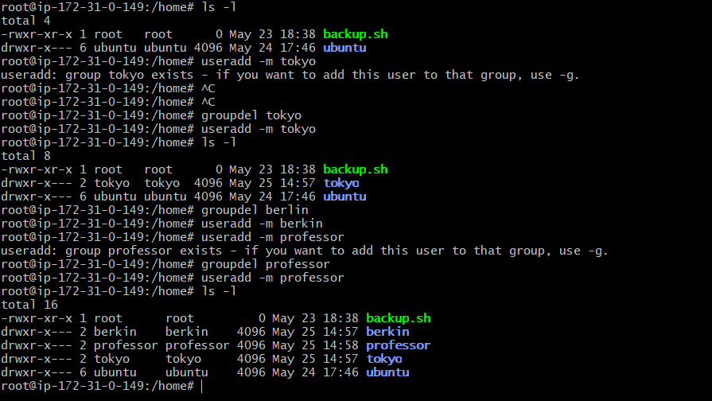
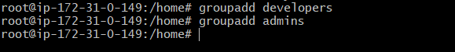
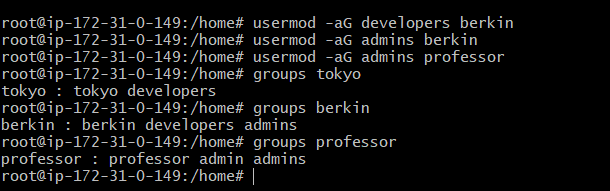

# Day 09 – Linux User & Group Management Challenge

## Task

### Task 1: Create Users

- useradd -m tokyo
- useradd -m berkin
- useradd -m professor

### Task 2: Create Groups

- groupadd developers
- groupadd admins

### Task 3: Assign to Groups

- usermod -aG developers tokyo
- usermod -aG developers berkin
- usermod -aG admins berkin
- usermod -aG admins professor

**To check group membership**

- groups tokyo
- groups berkin
- groups professor

