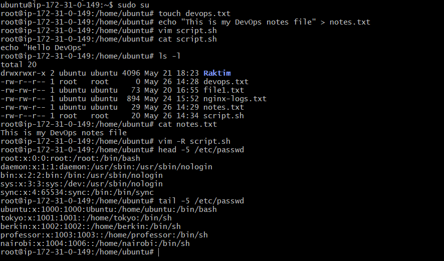
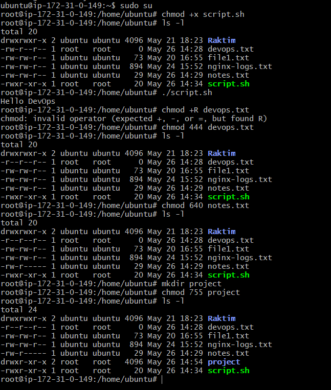
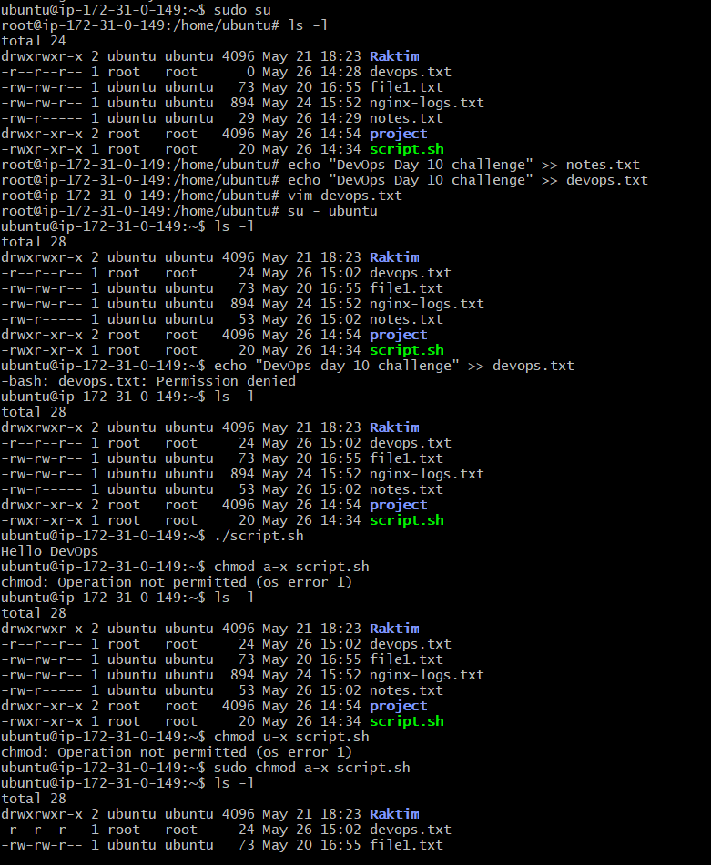
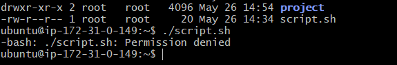

# Day 10 – File Permissions & File Operations Challenge

## Task

### Task 1: Create Files

- touch devops.txt
- echo "This is my DevOps notes file" > notes.txt
- vim script.sh
( Press i, write the content (echo "Hello DevOps") then save and exit)

**Verify files and permissions**

- ls -l

### Task 2: Read Files

- cat notes.txt
- vim -R script.sh
- head -5 /etc/passwd
- tail -5 /etc/passwd

### Task 3: Understand Permissions

- ls -l
- devops.txt -rw-r--r-- Owner can read/write, others can only read
- notes.txt -rw-rw-r--  Owner & group can read/write, others can read
- script.sh -rw-r--r--  Owner can read/write, others can only read

### Task 4: Modify Permissions

- chmod +x script.sh
- run the script(./script.sh)
- chmod 400 devops.txt
- chmod 640 notes.txt
- mkdir project
- chmod 755 project

**verify:** ls-l

1. Try writing to a read-only file - what happens?

- devops.txt -> -r--r--r--
- echo "New content" >> devops.txt
- I will get Permission denied

2. Try executing a file without execute permission

- script.sh -> -rw-r--r--
- try to execute ./script.sh
- I will get Permission denied

