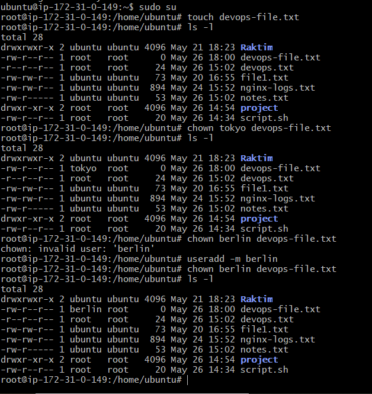

# Day 11 – File Ownership Challenge (chown & chgrp)

## Task

### Task 1: Understanding Ownership

- ls -l
- I have identified that some files are owned by ubuntu & some files are owned by root
**What's the difference between owner and group?**

- **Owner:** The main user who owns the file
- **Group:** A collection of users who can share access to the file

### Task 2: Basic chown Operations 

- touch devops-file.txt
- ls -l (Checked current owner is root)
- chown tokyo devops-file.txt(Changed owner to tokyo)
- chown berlin devops-file.txt(Changd owner to berlin)

