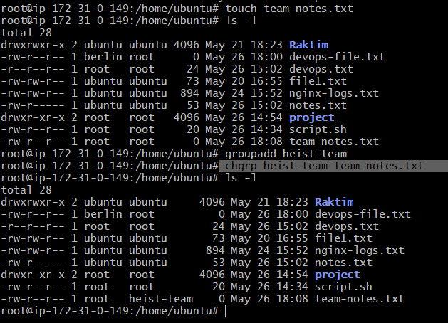
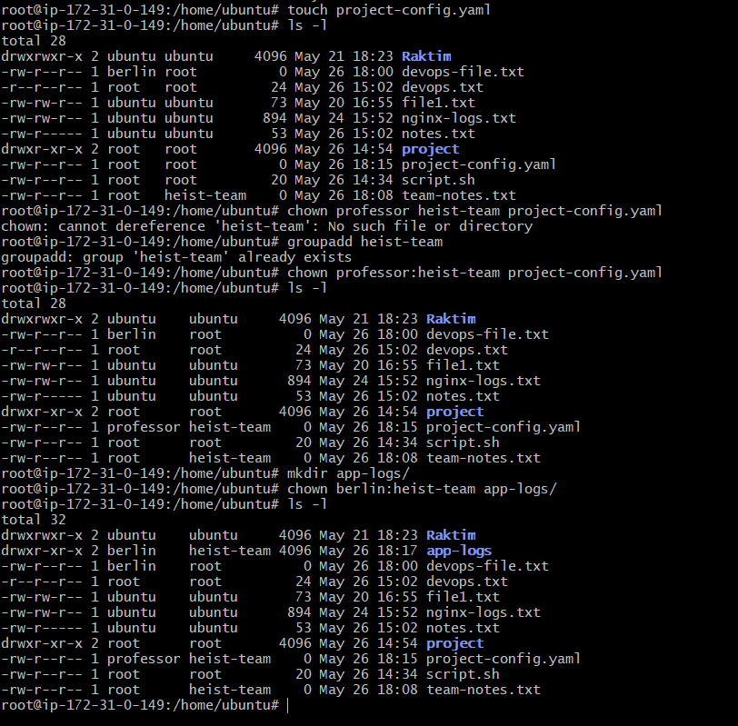
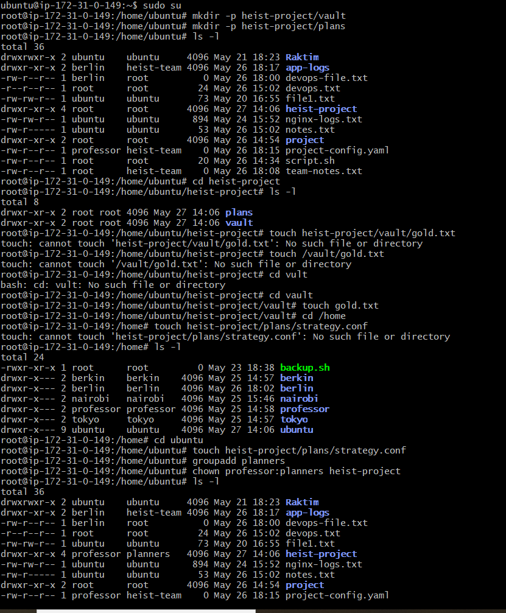
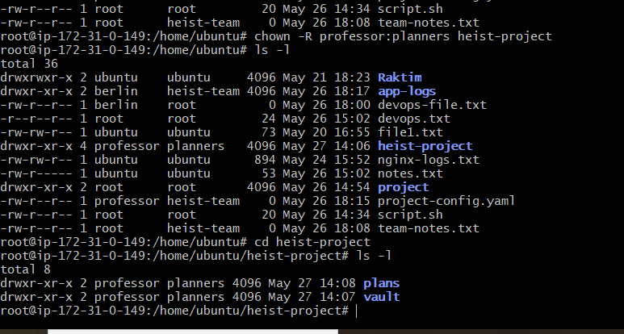
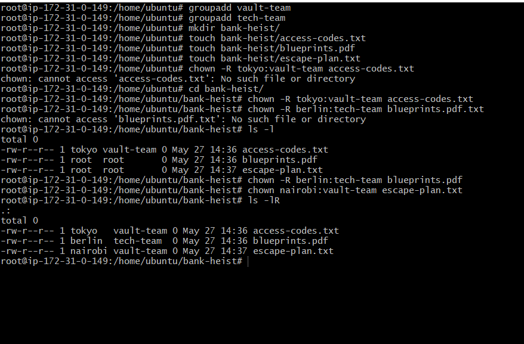

# Day 11 – File Ownership Challenge (chown & chgrp)

## Task

### Task 1: Understanding Ownership

- ls -l
- I have identified that some files are owned by ubuntu & some files are owned by root
**What's the difference between owner and group?**

- **Owner:** The main user who owns the file
- **Group:** A collection of users who can share access to the file

### Task 2: Basic chown Operations 

- touch devops-file.txt
- ls -l (Checked current owner is root)
- chown tokyo devops-file.txt(Changed owner to tokyo)
- chown berlin devops-file.txt(Changed owner to berlin)

### Task 3: Basic chgrp Operations

- touch team-notes.txt
- ls -l (Checked current owner is root)
- groupadd heist-team (Group added)
-  chgrp heist-team team-notes.txt
- ls -l

### Task 4: Combined Owner & Group Change

- touch project-config.yaml
- chown professor:heist-team project-config.yaml
- mkdir app-logs/
- chown berlin:heist-team app-logs/
- ls -l

### Task 5: Recursive Ownership

- mkdir -p heist-project/vault
- mkdir -p heist-project/plans
- touch heist-project/vault/gold.txt
- touch heist-project/plans/strategy.conf
- groupadd planners
- chown -R professor:planners heist-project
- Verify all files -> ls -lR heist-project/

### Task 6: Practice Challenge

- useradd -m tokyo
- useradd -m berlin
- useradd -m nairobi
- groupadd vault-team
- groupadd tech-team
- mkdir bank-heist/
- touch bank-heist/access-codes.txt
- touch bank-heist/blueprints.pdf
- touch bank-heist/escape-plan.txt
- chown -R tokyo:vault-team access-codes.txt
- chown -R berlin:tech-team blueprints.pdf
- chown nairobi:vault-team escape-plan.txt
- Verify all files -> ls -l

