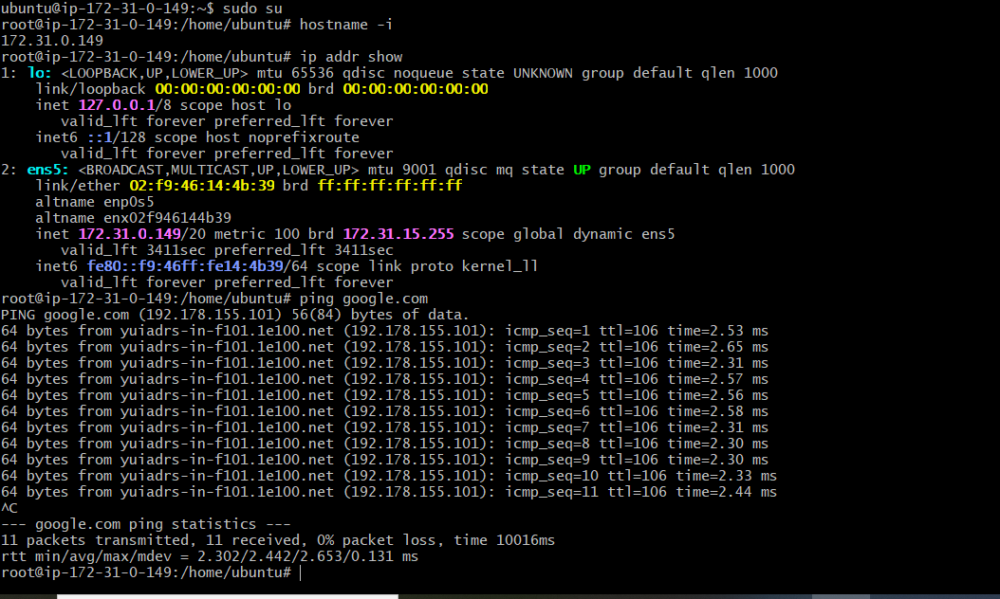
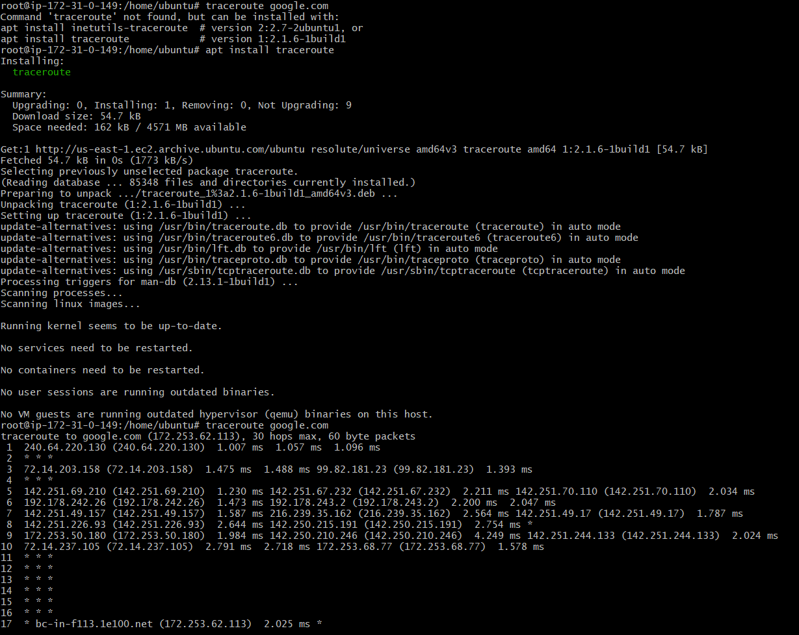
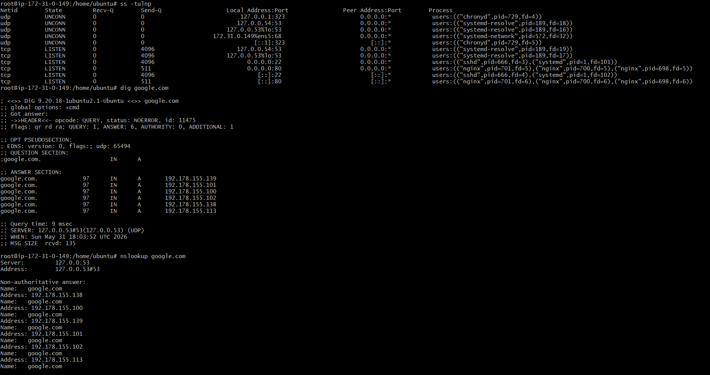
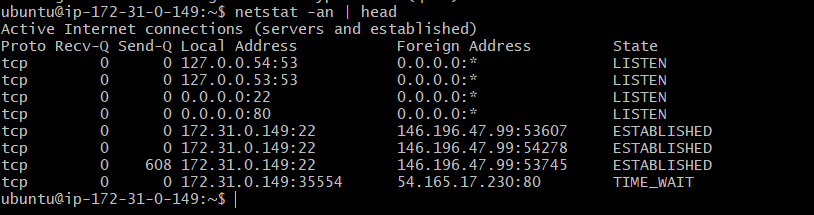
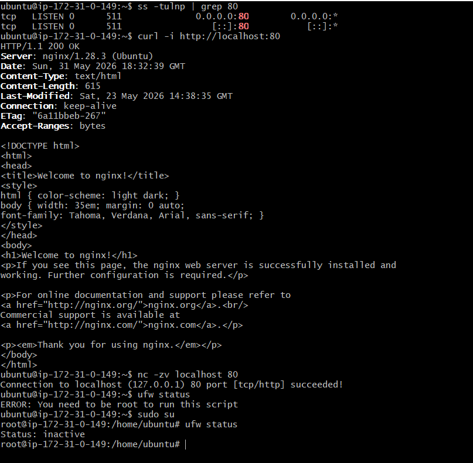

# Day 14 – Networking Fundamentals & Hands-on Checks

## Quick Concepts

**OSI Layers (L1–L7) vs TCP/IP Stack**

**OSI Model (7 Layers)**

- L1 Physical, L2 Data Link, L3 Network, L4 Transport, L5 Session, L6 Presentation, L7 Application.
- A conceptual model used to understand how network communication works.

**TCP/IP Model (4 Layers)**

- Link, Internet, Transport, Application.
- Practical model used by the Internet and modern networks.

OSI Layer	TCP/IP Layer
| :------------ | :----------- |
|L7 Application |	Application|
|L6 Presentation|	Application|
|L5 Session	    |   Application|
|L4 Transport   |	  Transport|
|L3 Network     |	   Internet|
|L2 Data Link   |	       Link|
|L1 Physical    |	       Link|

**Where Protocols Sit in the Stack**
- IP → Internet Layer (OSI Layer 3)
- TCP/UDP → Transport Layer (OSI Layer 4)
- DNS → Application Layer (uses UDP/TCP port 53)
- HTTP/HTTPS → Application Layer (uses TCP ports 80/443)

**Real Example**
- curl https://example.com

**Flow:**

Application Layer  → HTTPS
Transport Layer    → TCP
Internet Layer     → IP
Link Layer         → Ethernet/Wi-Fi

Or simply:

curl https://example.com
= Application (HTTPS)
  over TCP
  over IP
  over Ethernet/Wi-Fi

  **Hands-on Checklist**

  **Commands**
  - hostname -i
**Observation**

- Server IP address: 172.31.0.149
- Verified the network interface has an assigned IP address.

- ping -c 4 google.com
**Observation**
- Average latency: ~2.4 ms
- Packet loss: 0%
- Network connectivity is working normally.

- traceroute google.com
**Observation**
- Traffic reached destination through multiple hops.

- ss -tulnp
**Observation**
- Example service: SSH
- Listening Port: 22

- nslookup google.com
**Observation**
- Domain successfully resolved.
- Resolved IP: 192.178.155.138
- DNS service is functioning correctly.

- curl -I https://google.com
**Observation**
- HTTP Status Code: 200 OK (or 301/302 redirect)
- Web server responded successfully.

- curl -i https://www.google.com
**Observation**
- HTTP Status Code: 200 OK (or 301/302 redirect)
- Web server responded successfully.

- netstat -an | head
**Observation**
- LISTEN connections: 4
- ESTABLISHED connections: 3
- Verified active network connections on the server.

### Mini Task: Port Probe & Interpret

- ss -tulnp | grep 80 
- curl -i http://localhost:80
- nc -zv localhost 80

