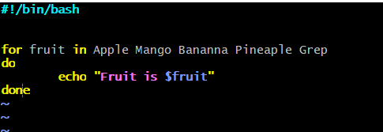
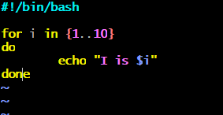
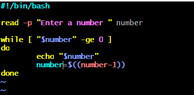
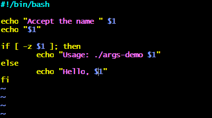
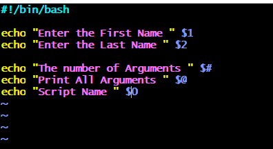
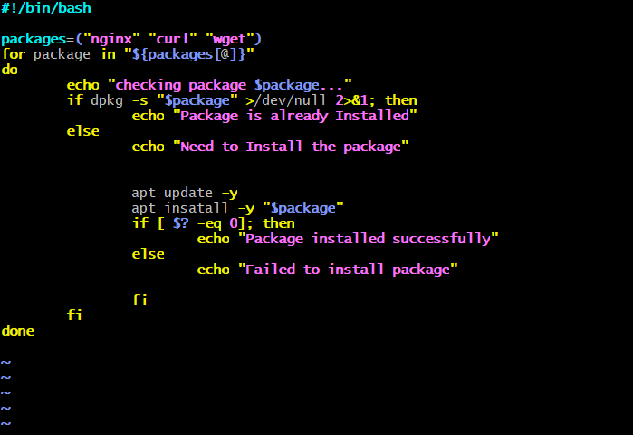
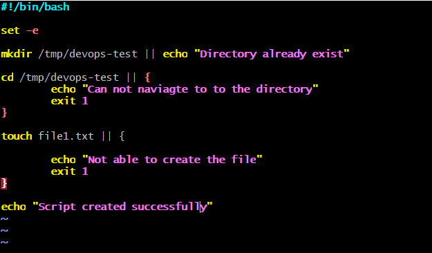

# Day 17 – Shell Scripting: Loops, Arguments & Error Handling

## Task

### Task 1: For Loop
1. 

2. 

### Task 2: While Loop
1. 

### Task 3: Command-Line Arguments
1. 

2. 

### Task 4: Install Packages via Script
1. 

### Task 5: Error Handling

