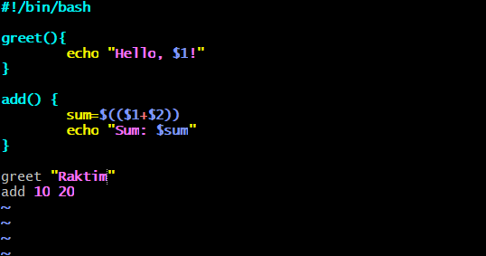
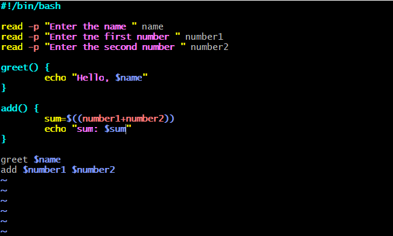
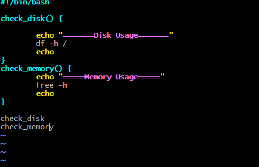
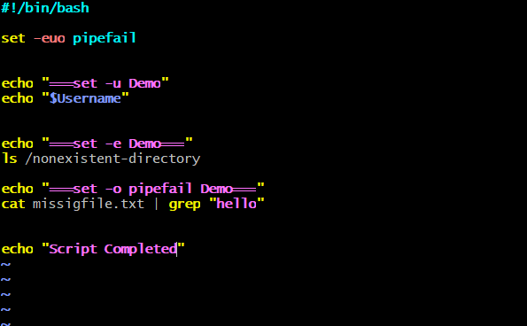
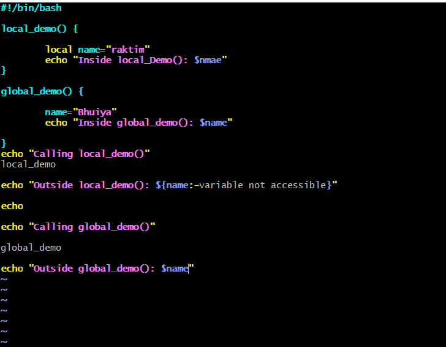
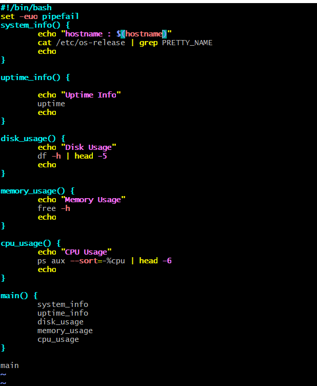

# Day 18 – Shell Scripting: Functions & intermediate Concepts

## Task

### Task 1: Basic Functions

### Task 2: Functions with Return Values

### Task 3: Strict Mode — `set -euo pipefail`

### Task 4: Local Variables

### Task 5: Build a Script — System Info Reporter

