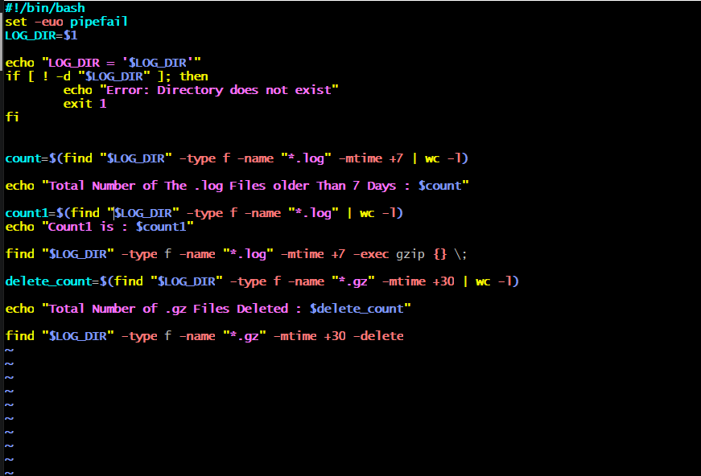
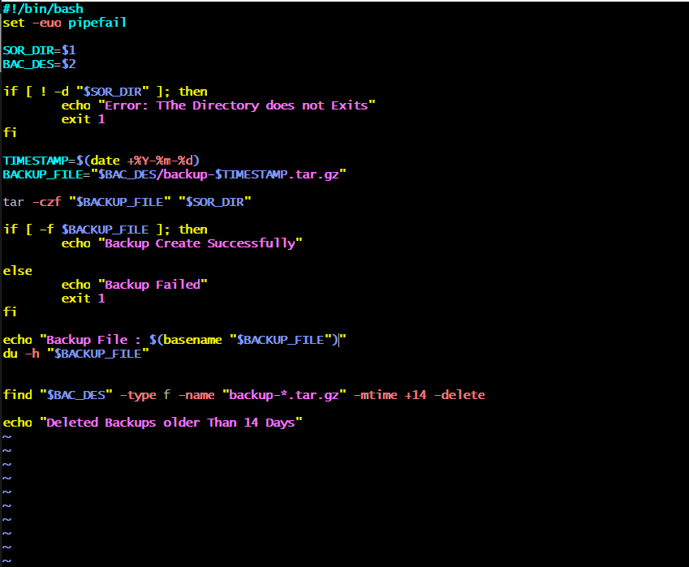
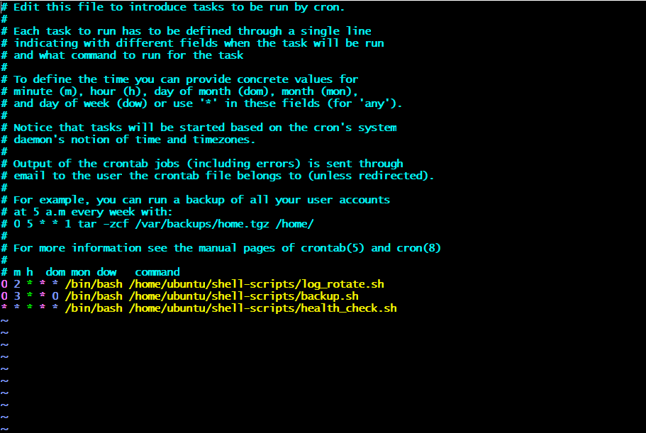
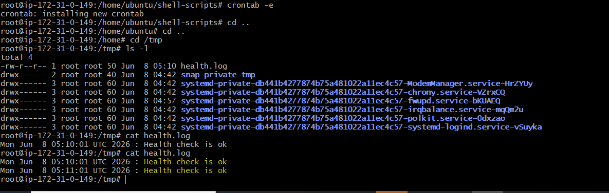
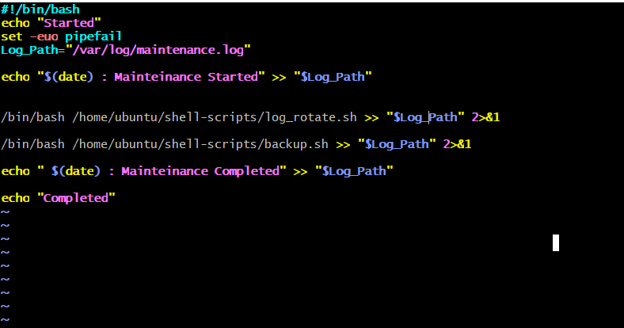
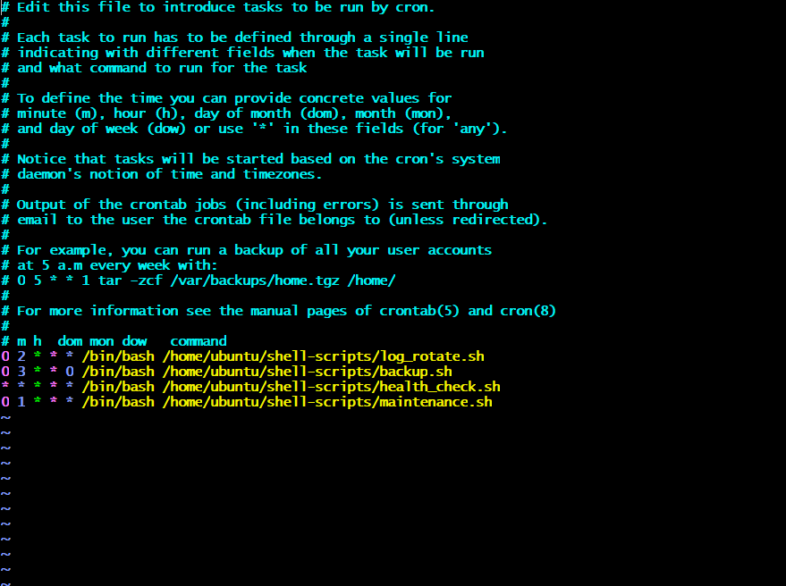

# Day 19 – Shell Scripting Project: Log Rotation, Backup & Crontab

## Task

### Task 1: Log Rotation Script

### Task 2: Server Backup Script

### Task 3: Crontab

- crontab -l
- crontab -e(Editor)

### Task 4: Combine — Scheduled Maintenance Script

