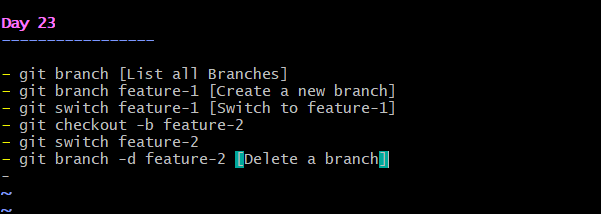

# Day 23 – Git Branching & Working with GitHub

## Task

### Task 1: Understanding Branches

1. What is a branch in Git?
- A Git branch is an independent line of development that allows you to work on changes without     affecting the main codebase.

git branch feature-login

2. Why do we use branches instead of committing everything to `main`?
- Branches allow developers to work on features, bug fixes, or experiments independently without affecting the stable code in main. This reduces risk, improves collaboration, and ensures changes can be tested before being merged into the main branch.

3. What is `HEAD` in Git?
- HEAD is a pointer that refers to the current branch or the latest commit you're currently working on.

4. What happens to your files when you switch branches?

- When you switch branches, Git updates the files in your working directory to match the latest commit of the target branch. Files may be added, removed, or have different content depending on what exists in that branch.

**Example:**

main → app.txt contains Version 1
feature → app.txt contains Version 2

**Running:**

- git checkout feature

changes app.txt from Version 1 to Version 2 in the same working directory.

### Task 2: Branching Commands — Hands-On

### Task 3: Push to GitHub

6. Answer in your notes: What is the difference between `origin` and `upstream`?

- origin is the remote repository that you own and where you push your changes.
- upstream is the original repository from which you forked or cloned a project, used to receive   updates from the source project.

### Task 4: Pull from GitHub

3. Answer in your notes: What is the difference between `git fetch` and `git pull`?

- git fetch downloads the latest changes from the remote repository but does not merge them into your current branch.
- git pull downloads the latest changes and automatically merges them into your current branch.
**Example**
- git fetch origin

Downloads updates from GitHub but leaves your branch unchanged.

- git pull origin main

Downloads updates and merges them into your local main branch.

### Task 5: Clone vs Fork

1. What is the difference between clone and fork?

- Clone creates a local copy of a repository on your machine.
- Fork creates a copy of someone else's repository under your own GitHub account.

**Clone:**
GitHub Repo → Your Local Machine

**Fork:**
Original Repo → Your GitHub Account → Your Local Machine

2. When would you clone vs fork?

- Use Clone when you have direct access to the repository and want to work on it locally.
- Use Fork when you want to contribute to someone else's repository but don't have write access to the original repository.

**Example:**

- Cloning your team's internal repository.
- Forking an open-source project before making changes and submitting a Pull Request.

3. After forking, how do you keep your fork in sync with the original repo?

- After forking a repository, you can keep your fork updated by adding the original repository as an upstream remote. Then, periodically fetch the latest changes from the upstream repository, merge them into your local branch, and push the updated branch to your fork on GitHub. This ensures your fork stays synchronized with the latest changes from the original project.