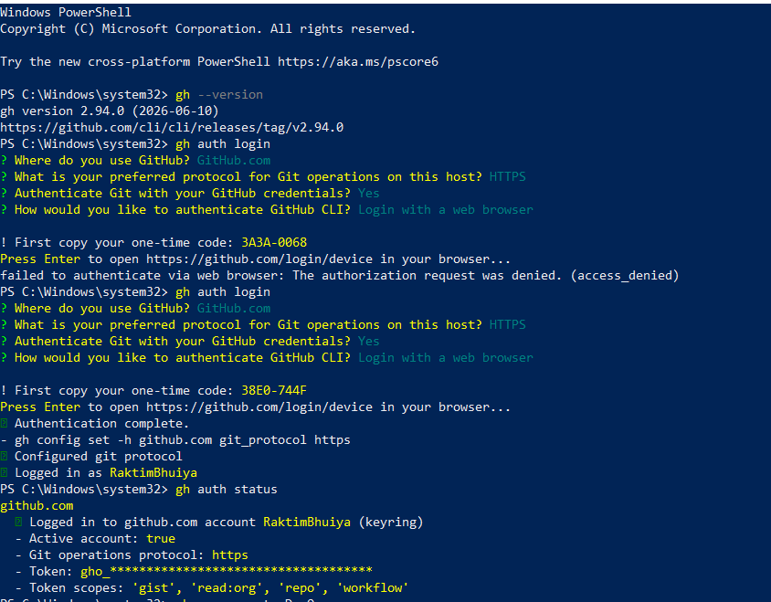
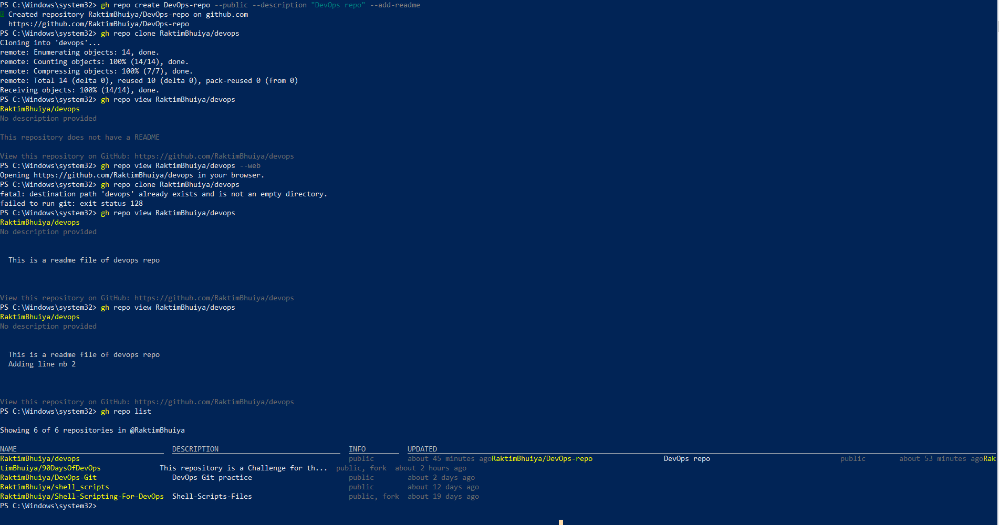
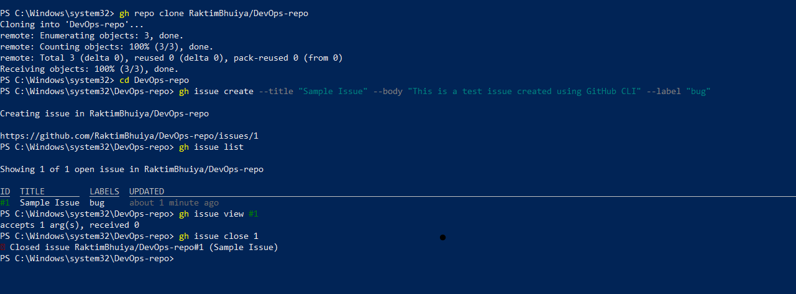
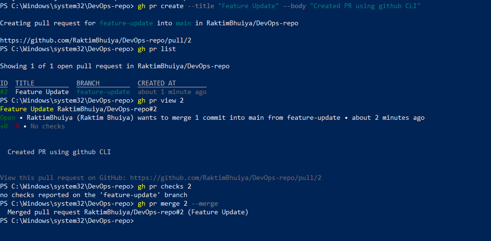

# Day 26 – GitHub CLI: Manage GitHub from Your Terminal

## Task

### Task 1: Install and Authenticate

- gh --version
- gh auth login
- ghauth status

### Task 2: Working with Repositories

- gh repo create test-repo --public --add-readme
- gh repo clone username/repo-name
- gh repo view username/repo-name
- gh repo list
- gh repo view --web
- gh repo delete test-repo --confirm [Force Delete]

### Task 3: Issues

- gh issue create --title "Sample Issue" --body "This is a test issue created using GitHub CLI." --label "bug"
- gh issue list
- gh issue view 1
- gh issue close 1

**How could you use gh issue in a script or automation?**
- Automatically create issues when CI/CD pipelines fail.
- Create issues for security vulnerabilities detected during scans.
- Generate issues from monitoring and alerting systems.
- Automatically assign and label issues based on predefined rules.
- Close issues automatically when related pull requests are merged.
- Create recurring maintenance or operational tasks through scheduled scripts.

### Task 4: Pull Requests

- gh pr create --title "Feature Update" --body "Created PR using GitHub CLI"
- gh pr list
- gh pr view <pr number>
- gh pr checks <pr number>
- gh pr merge <pr nuber> --merge

### Task 5: GitHub Actions & Workflows (Preview)

# List workflow runs for the current repository
- gh run list

# List workflow runs for a specific repository
- gh run list --repo <username>/<repo-name>

# View details of a specific workflow run
- gh run view <run-id>

# View workflow run with logs
- gh run view <run-id> --log

# Watch a workflow run in real time
- gh run watch <run-id>

**How could `gh run` and `gh workflow` be useful in a CI/CD pipeline?**

- gh run and gh workflow are useful in CI/CD pipelines because they allow engineers to monitor, manage, and automate GitHub Actions workflows directly from the terminal. They can be used to check workflow status, trigger workflows manually, view logs for troubleshooting, track build and deployment progress, and automate pipeline operations through scripts, making CI/CD management faster and more efficient.

### Task 6: Useful `gh` Tricks
# 1. gh api - Make raw GitHub API calls
- gh api user
- gh api repos/<username>/<repo-name>

# 2. gh gist - Create and manage GitHub Gists
- gh gist create notes.txt
- gh gist list
- gh gist view <gist-id>

# 3. gh release - Create and manage releases
- gh release list
- gh release create v1.0.0 --title "Version 1.0.0" --notes "First release"
- gh release view v1.0.0

# 4. gh alias - Create shortcuts for frequently used commands
- gh alias set prs "pr list"
- gh prs

# 5. gh search repos - Search GitHub repositories
- gh search repos terraform
- gh search repos kubernetes --limit 5
- gh search repos "devops tools"
