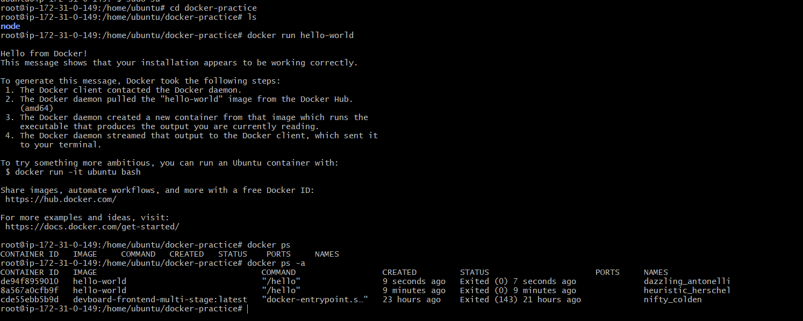
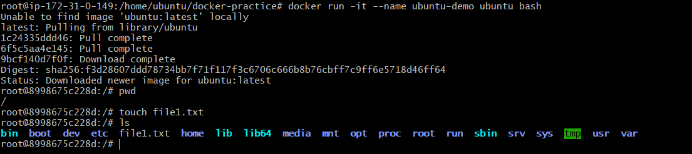

# Day 29 – Introduction to Docker

## Task

### Task 1: What is Docker?

- Docker is an open-source containerization platform that allows you to package an application along with all its dependencies, libraries, and configurations into a container. This ensures the application runs consistently across different environments.

**What is a container and why do we need them?**
- A container is a lightweight, isolated package that contains an application along with all its dependencies, libraries, and configurations needed to run.

**Why do we need Containers?**
- Ensure applications run consistently across environments.
- Eliminate "it works on my machine" issues.
- Simplify deployment and scaling.
- Use fewer resources compared to virtual machines.
- Enable faster CI/CD and DevOps workflows.

**Containers vs Virtual Machines (VMs)**
|Feature	|Containers	|Virtual Machines|
|:-----------|:-----------|:----------------|
|Virtualization Level	|OS-level virtualization	|Hardware-level virtualization|
|OS Included	|Share host OS kernel	|Each VM has its own OS|
|Size	|MBs	|GBs|
|Startup Time	|Seconds	|Minutes|
|Resource Usage	|Lightweight	|Heavy|
|Performance	|Near-native	|Slight overhead|
|Isolation	|Process-level	|Full OS-level|
|Use Case	|Microservices, CI/CD, DevOps	|Running multiple OSs, legacy apps|

**What is the Docker architecture? (daemon, client, images, containers, registry)**

**Docker Architecture**

Docker follows a client-server architecture where the Docker Client communicates with the Docker Daemon to build, run, and manage containers.

**Components**
1. Docker Client

- The command-line interface (CLI) used by users.
- Sends commands to the Docker Daemon.

Example:
- docker run nginx
- docker build -t myapp .

2. Docker Daemon (dockerd)

- The background service that manages Docker objects.
- Builds images, creates containers, manages networks and volumes.
- Listens for Docker API requests.

3. Docker Images

Read-only templates used to create containers.
Contain application code, libraries, dependencies, and configurations.

Example:

- nginx
- ubuntu
- node

4. Docker Containers

- Running instances of Docker images.
- Lightweight and isolated environments where applications execute.

Example:

- docker run nginx

creates a container from the nginx image.

5. Docker Registry
- Stores and distributes Docker images.
- Can be public or private.

Examples:

- Docker Hub
- Azure Container Registry (ACR)
- Amazon ECR

**Architecture Flow**
```text
Docker Client
      │
      ▼
Docker Daemon
      │
 ┌────┼────┐
 ▼    ▼    ▼
Images Containers Networks
      │
      ▼
Docker Registry
```

# Task 2: Install Docker

- sudo apt-get install docker.io
- docker --version
- docker run hello-world



### Task 3: Run Real Containers




- docker ps
- docker ps -a
- docker stop <container id> && docker rm <container id>

### Task 4: Explore

**Run a Container in Detached Mode — What's Different?**

**Command:**

- docker run -d nginx

**Difference:**

- -d = Detached mode
- Container runs in the background.
- Terminal is immediately returned to you.
- Useful for web servers, databases, APIs, etc.

**Give a Container a Custom Name**

**Command:**

- docker run -d --name my-nginx nginx

**Map a Port from the Container to Your Host**

**Command:**

- docker run -d --name my-nginx -p 8080:80 nginx

**Check Logs of a Running Container**

**Command:**

- docker logs my-nginx

**Run a Command Inside a Running Container**

**Open a shell:**

- docker exec -it my-nginx bash