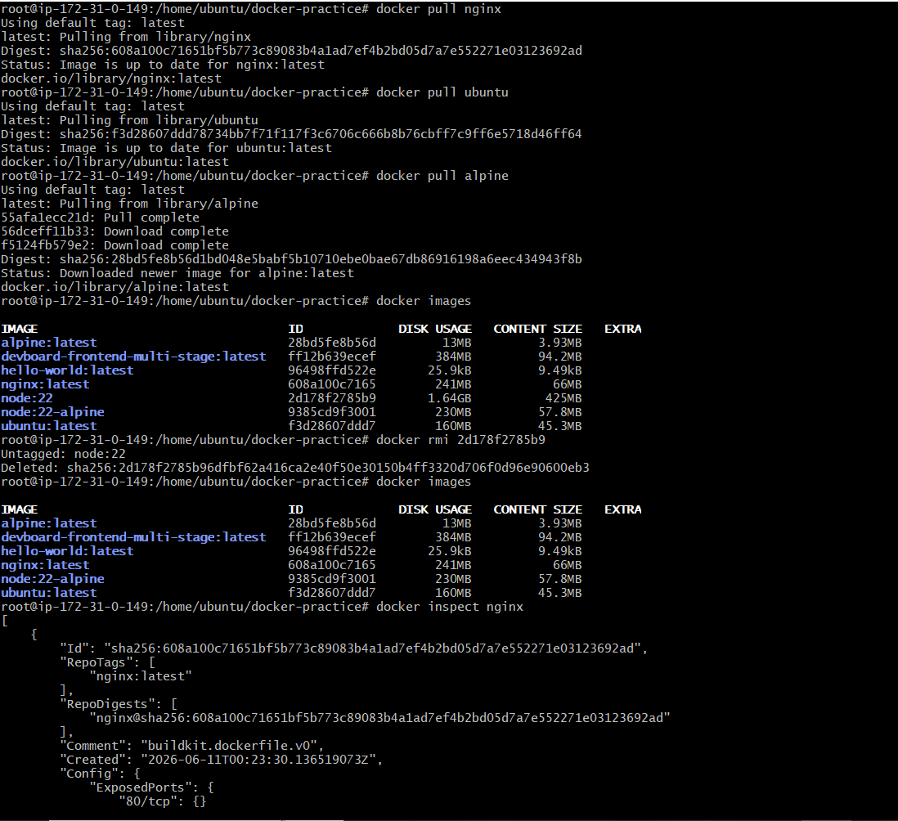
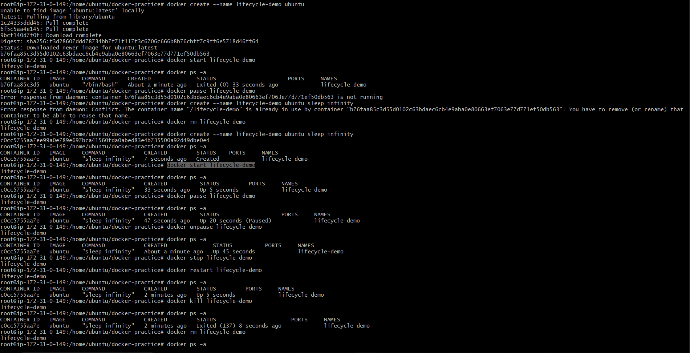
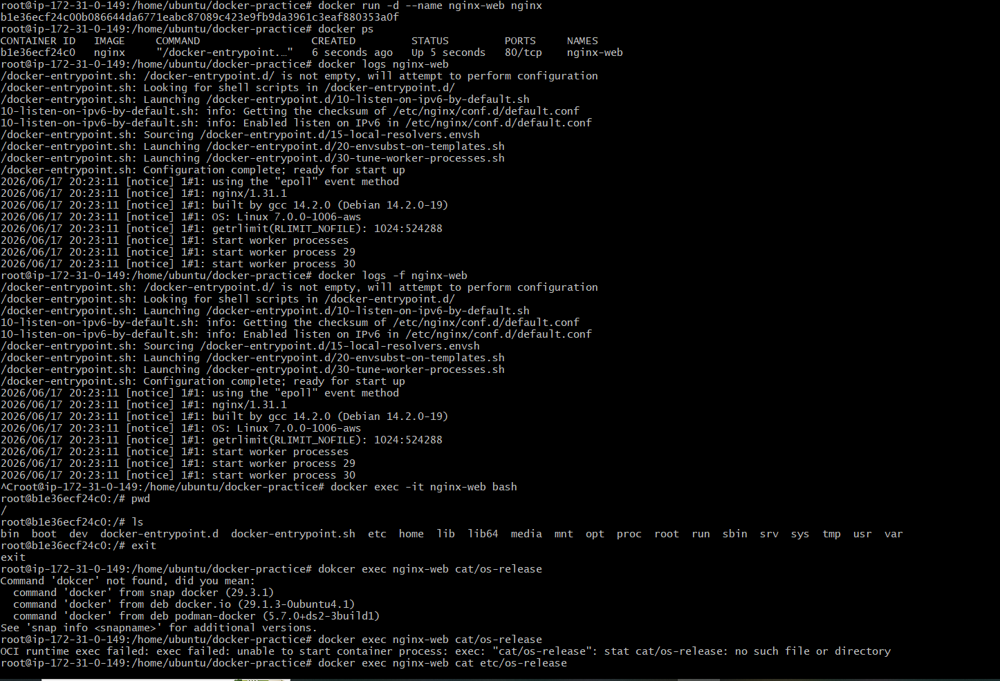
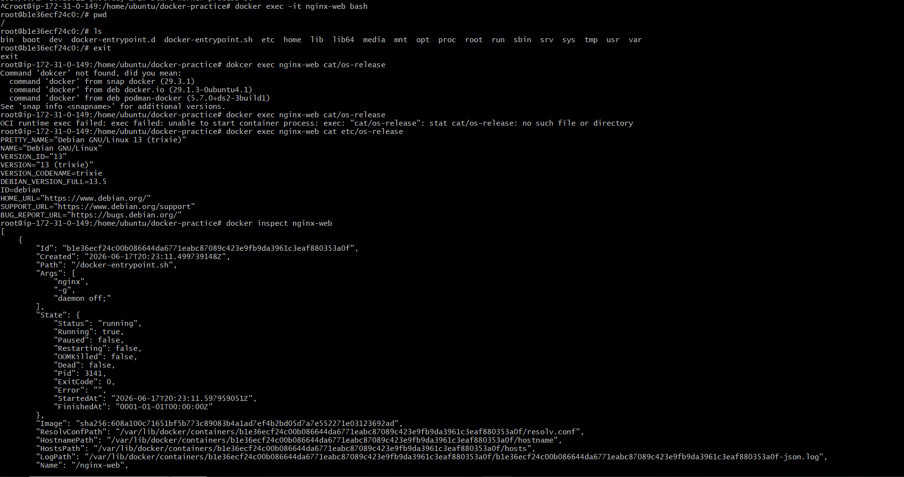
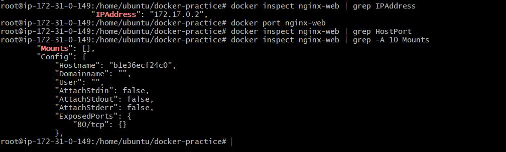

# Day 30 – Docker Images & Container Lifecycle

## Task

### Task 1: Docker Images

- dokcer pull nginx
- docker pull ubuntu
- docker pull alpine
- docker images

**Compare Ubuntu vs Alpine — Why Is Alpine Much Smaller?**
|Ubuntu	|Alpine|
|:-------|:------|
|Full-featured Linux distribution	|Minimal Linux distribution|
|Includes many utilities and packages	|Includes only essential packages|
|Larger image size (~70–80 MB)	|Very small image (~5–10 MB)|
|Easier for beginners	|Optimized for containers|
|Uses glibc	|Uses musl libc|

- dokcer inspect nginx
- docker rmi ubuntu



### Task 2: Image Layers

**Run Image History**

- docker image history nginx
```text
IMAGE          CREATED        CREATED BY                      SIZE
abcd1234       2 weeks ago    CMD ["nginx" "-g" ...]          0B
abcd1234       2 weeks ago    EXPOSE 80                       0B
abcd1234       2 weeks ago    COPY docker-entrypoint.sh       4KB
abcd1234       2 weeks ago    RUN apt-get install ...         120MB
abcd1234       2 weeks ago    ADD rootfs.tar.xz               80MB
```

**Why Do Some Layers Show Sizes and Others Show 0B?**

Layers that add, modify, or delete files consume storage and show a size:

- RUN apt-get install nginx
- COPY app/ /app
- ADD file.tar.gz /

**Example:**
```text
120MB
5MB
20KB
```
Layers that only add metadata/configuration do not change the filesystem and show 0B:
```text
CMD ["nginx"]
EXPOSE 80
ENV APP=prod
WORKDIR /app
```
```text
Example:

0B
0B
0B
```

**What Are Docker Layers and Why Does Docker Use Them?**
**What are Layers?**

A Docker image is made up of multiple read-only layers stacked on top of each other.

Each Dockerfile instruction creates a new layer.

Example:
```text
FROM ubuntu
RUN apt update
RUN apt install nginx
COPY index.html /usr/share/nginx/html
```
Creates:
```text
Layer 1 → Ubuntu Base Image
Layer 2 → apt update
Layer 3 → nginx installation
Layer 4 → index.html copied
```
**Why Does Docker Use Layers?**

Docker images are built using layered filesystems. Each instruction in a Dockerfile creates a separate read-only layer. Docker uses layers to improve build speed, reduce storage consumption through layer sharing, and optimize image distribution by downloading only changed layers. Layers that modify the filesystem have a size, while metadata-only instructions such as CMD, ENV, and EXPOSE typically show 0B.

### Task 3: Container Lifecycle

- docker create --name lifecycle-demo ubuntu
- docker start lifecycle-demo
- docker pause lifecycle-demo
- docker unpause lifecycle-demo
- docker stop lifecycle-demo
- docker restart lifecycle-demo
- docker kill lifecycle-demo
- docker rm lifecycle-demo



### Task 4: Working with Running Containers

- docker run -d --name nginx-web nginx
- docker logs nginx-web
- docker logs -f nginx-web
- docker exec -it nginx-web bash
- docker exec nginx-web cat /etc/os-release
- docker inspect nginx-web
- dokcer inspect nginx-web | grep IPAdress
- docker inspect nginx-web | grep HostPort
- docker inspect nginx-web | grep -A 10 Mounts



