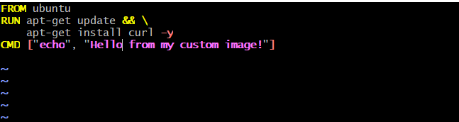
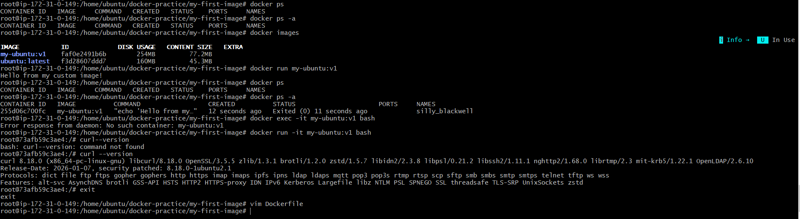
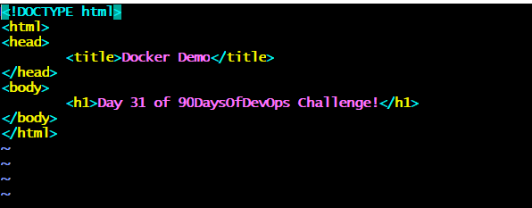
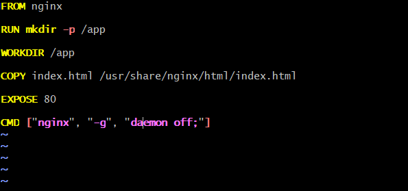
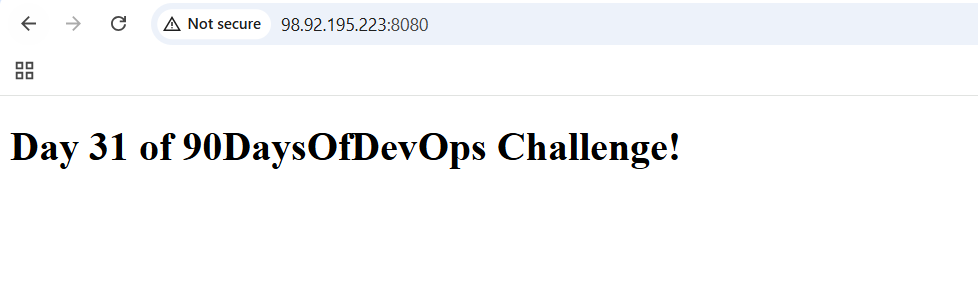
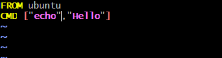
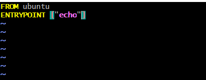

# Day 31 – Dockerfile: Build Your Own Images

## Task

### Task 1: Your First Dockerfile

- mkdir my-first-image
- vim Dockerfile

- docker build -t my-ubuntu:v1 .
- docker run my-ubuntu

### Task 2: Dockerfile Instructions

- vim index.html

- vim Dockerfile

- docker ps

### Task 3: CMD vs ENTRYPOINT
1. 
- 

- Output: **Hello**
- docker run hello-image:v1 date
- Output: Thu Jun 18 20:22:19 UTC 2026

2. 
- 

- docker run dockefile-entrypoint:v1 hello
Output: **Hello**

3. When would you use CMD vs ENTRYPOINT?

- CMD → Use when you want to provide a default command that users can override.

- ENTRYPOINT → Use when you want the container to always run a specific executable, while allowing users to pass additional arguments.