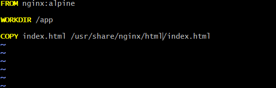
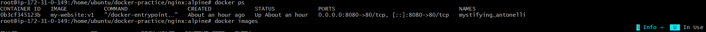
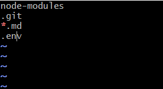

# Day 31 – Dockerfile: Build Your Own Images

## Task

### Task 1: Your First Dockerfile

- mkdir my-first-image
- vim Dockerfile


- docker build -t my-ubuntu:v1 .
- docker run my-ubuntu


### Task 2: Dockerfile Instructions

- vim index.html


- vim Dockerfile


- docker ps


### Task 3: CMD vs ENTRYPOINT
1. 
 

- Output: **Hello**
- docker run hello-image:v1 date
- Output: Thu Jun 18 20:22:19 UTC 2026

2. 
 

- docker run dockefile-entrypoint:v1 hello
Output: **Hello**

3. When would you use CMD vs ENTRYPOINT?

- CMD → Use when you want to provide a default command that users can override.

- ENTRYPOINT → Use when you want the container to always run a specific executable, while allowing users to pass additional arguments.

### Task 4: Build a Simple Web App Image

- mkdir nginx:alpine
- vim Dockerfile



- docker build -t my-website:v1 .
- docker run -d -p 8080:80 my-website:v1


### Task 5: .dockerignore

- vim .dockerignore



**Why Do We Use .dockerignore?**
- Reduces image build time
- Reduces image size
- Prevents sensitive files (.env) from being included
- Avoids copying unnecessary files (node_modules, .git)
- Makes CI/CD pipelines faster

### Task 6: Build Optimization

**Observe Docker Cache**

**Example Dockerfile:**
```text
FROM ubuntu

RUN apt-get update && apt-get install -y curl

COPY index.html /app/index.html

CMD ["cat", "/app/index.html"]
```
**Build:**

- docker build -t cache-demo:v1 .

**Output:**
```text
Step 1/4 : FROM ubuntu
 ---> Using cache

Step 2/4 : RUN apt-get update ...
 ---> Running

Step 3/4 : COPY index.html ...
 ---> Running
```
**Now change only:**
```text
<h1>Hello Docker</h1>
```
to
```text
<h1>Hello Docker Updated</h1>
```
**Rebuild:**

- docker build -t cache-demo:v1 .

**Output:**
```text
Step 1/4 : FROM ubuntu
 ---> Using cache

Step 2/4 : RUN apt-get update ...
 ---> Using cache

Step 3/4 : COPY index.html ...
 ---> Rebuilding
```

- Notice Docker reused previous layers and rebuilt only the changed layer and layers after it.

2. **Bad Dockerfile Order**
```text
FROM node:18

COPY . .

RUN npm install

CMD ["npm","start"]
```
Problem:

If any source file changes:
```text
COPY . .
```
- changes → npm install runs again → slow build.

3. **Optimized Dockerfile Order**
```text
FROM node:18

COPY package*.json ./

RUN npm install

COPY . .

CMD ["npm","start"]
```
**Now:**
```text
package.json unchanged
      ↓
npm install layer reused
      ↓
Only source code copied
      ↓
Faster build
```

**Why does layer order matter for build speed?**

Docker builds images layer by layer and caches each layer. If a layer changes, Docker rebuilds that layer and all subsequent layers. Placing frequently changing instructions (such as COPY . .) near the end of the Dockerfile allows earlier layers to be reused from cache, significantly reducing build time.