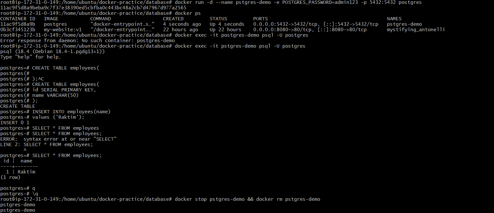
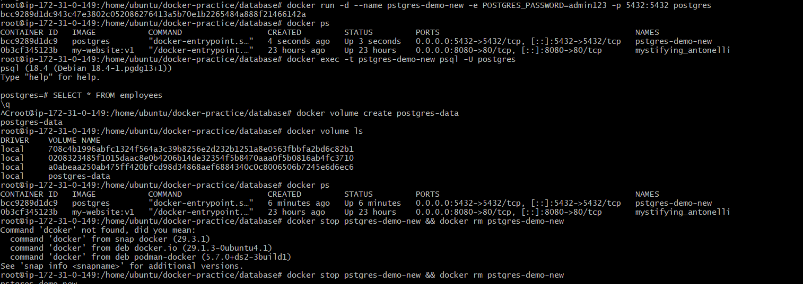
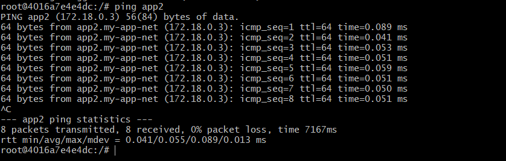
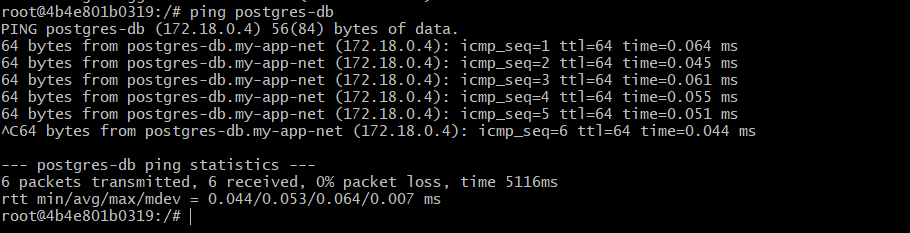

# Day 32 – Docker Volumes & Networking

## Task

### Task 1: The Problem

1. docker run -d --name pstgres-demo -e POSTGRES_PASSWORD=admin123 -p 5432:5432 postgres
2. docker exec -it postgres-demo psql -U postgres
3. ```text
CREATE TABLE employees (
    id SERIAL PRIMARY KEY,
    name VARCHAR(50)
);

INSERT INTO employees (name)
VALUES ('Raktim');

SELECT * FROM employees;
```
Expected:
```text
 id |  name
----+--------
  1 | Raktim
  ```
  4. docker stop pstgres-demo && docker rm pstgres-demo



  5. Again create a new container(docker run -d --name pstgres-demo-new -e POSTGRES_PASSWORD=admin123 -p 5432:5432 postgres)
  - go inside the container( docker exec -t pstgres-demo-new psql -U postgres) and serach with SELECT * FROM emplyoees. No data is exist.



  **Why Did This Happen?**

By default:
```text
Container
 ├── Application
 ├── Database
 └── Data
```
All data is stored inside the container's writable layer.

When you remove the container:

docker rm postgres-demo
```text
Docker removes:

Container
Application
Database files
Stored data
```

### Task 2: Named Volumes

- docker volume create postgres-data
- docker volume ls
- docker run -d --name postgres-vol -e POSTGRES_PASSWORD=admin123 -p 5432:5432 -v postgres-data:/var/lib/postgresql/data postgres
- docker exec -it postgres-vol psql -U postgres
- Create a table
```text
CREATE TABLE employees (
    id SERIAL PRIMARY KEY,
    name VARCHAR(50)
);

INSERT INTO employees(name)
VALUES ('Raktim');

SELECT * FROM employees;
```
- docker stop postgres-vol && docker rm postgres-vol
- docker run -d \
--name postgres-vol-new \
-e POSTGRES_PASSWORD=admin123 \
-p 5432:5432 \
-v postgres-data:/var/lib/postgresql/data \
postgres

- docker exec -it postgres-vol-new psql -U postgres
- SELECT * FROM employees;[To check the database still exist or not]
- docker volume ls

## is your data still there?

**Yes, the data was still there.** The PostgreSQL container was removed, but the named volume persisted and retained all database files. When a new container was created using the same volume, the previously created table and records were still available.


### Task 3: Bind Mounts

- docker run -d \
--name nginx-bind \
-p 8080:80 \
-v $(pwd):/usr/share/nginx/html \
nginx

## What happened after refresh?

After updating index.html on the host machine and refreshing the browser, the changes appeared immediately because the container was using a bind mount that directly mapped the host directory into the container.

## Task 4: Docker Networking Basics

- docker network ls
- docker network inspect bridge
- docker run -dit --name container1 ubuntu bash
- docker run -dit --name container2 ubuntu bash
- docker ps
- docker inspect container2 | grep IPAddress
- docker exec -it container1 bash
- apt update && apt install -y iputils-ping
- ping IP

## Can containers on the default bridge network ping each other by name?

- No. Containers connected to Docker's default bridge network cannot resolve each other's container names automatically.

## Can containers on the default bridge network ping each other by IP?

- Yes. Containers on the default bridge network can communicate directly using their assigned IP addresses. Docker assigns an internal IP to each container within the bridge network.

### Task 5: Custom Networks

- docker network create my-app-net
- docker network ls
- docker run -dit --name app1 --network my-app-net ubuntu bash
- docker run -dit --name app2 --network my-app-net ubuntu bash
- docker ps
- docker exec -it app1 bash
- apt update && apt install -y iputils-ping
- ping app2 -> Suceess



## Why does custom networking allow name-based communication but the default bridge doesn't?

ustom bridge networks support name-based communication because Docker provides an embedded DNS service that automatically resolves container names to IP addresses. The default bridge network does not have this automatic DNS-based service discovery, so containers can communicate only through IP addresses.

### Task 6: Put It Together

- docker network create my-app-net
- docker network ls
- docker volume create app-data
- docker run -d \
--name postgres-db \
--network my-app-net \
-e POSTGRES_PASSWORD=admin123 \
-v app-data:/var/lib/postgresql/app \
postgres
- docker ps
- docker run -dit \
--name app-container \
--network my-app-net \
ubuntu bash
- docker exec -it app-container bash
- apt update && apt install -y iputils-ping
- ping postgres-db -> Success

