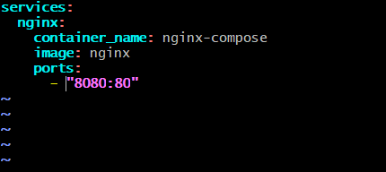
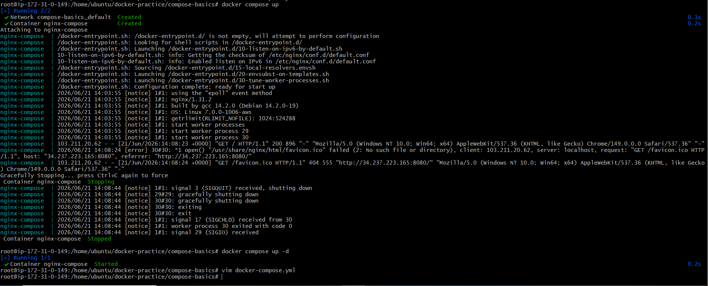
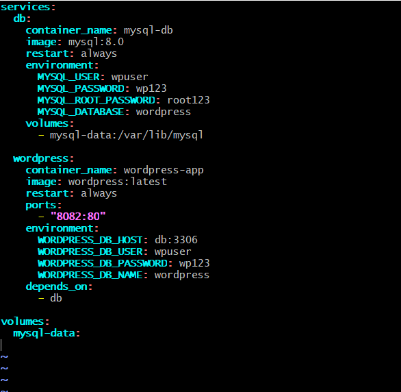
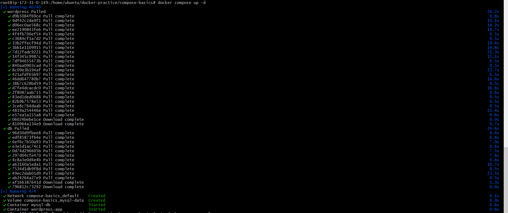
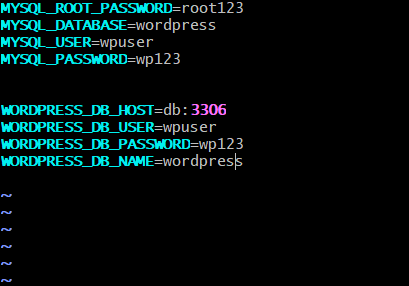
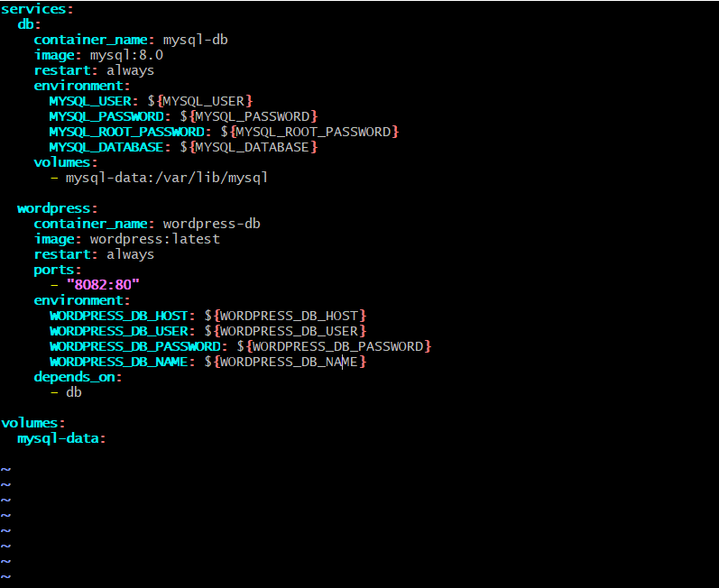
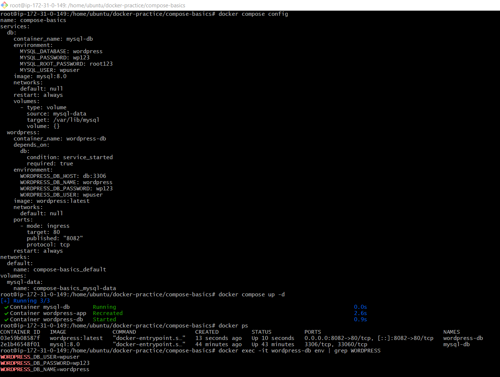

# Day 33 – Docker Compose: Multi-Container Basics

## Task

### Task 1: Install & Verify

- apt get update
- apt install docker-compose-v2
- docker compose version

### Task 2: Your First Compose File

- 
- docker compose up -d



- docker compose down

### Task 3: Two-Container Setup

- 
- docker compose up -d
- 

is your WordPress data still there?

- ✅ Yes.

The WordPress site configuration and content remain because MySQL stores its data in the named volume:
```text
mysql-data
``

For this task, create a new folder and a `docker-compose.yml`.

### `docker-compose.yml`

```yaml
version: '3.8'

services:
  db:
    image: mysql:8.0
    container_name: mysql-db
    restart: always
    environment:
      MYSQL_ROOT_PASSWORD: root123
      MYSQL_DATABASE: wordpress
      MYSQL_USER: wpuser
      MYSQL_PASSWORD: wp123
    volumes:
      - mysql-data:/var/lib/mysql

  wordpress:
    image: wordpress:latest
    container_name: wordpress-app
    restart: always
    ports:
      - "8080:80"
    environment:
      WORDPRESS_DB_HOST: db:3306
      WORDPRESS_DB_USER: wpuser
      WORDPRESS_DB_PASSWORD: wp123
      WORDPRESS_DB_NAME: wordpress
    depends_on:
      - db

volumes:
  mysql-data:
```

---

### Understanding the Important Parts

#### Service Names

```yaml
services:
  db:
```

```yaml
WORDPRESS_DB_HOST: db:3306
```

Here `db` is the MySQL service name.

Docker Compose automatically creates a network and DNS entry:

```text
wordpress
      ↓
db
      ↓
mysql container
```

So WordPress can reach MySQL using:

```text
db:3306
```

without knowing the IP address.

---

#### Named Volume

```yaml
volumes:
  - mysql-data:/var/lib/mysql
```

```text
mysql-data
      ↓
Stores database files
      ↓
Data survives container deletion
```

---

### Start the Application

```bash
docker compose up -d
```

Verify:

```bash
docker ps
```

Expected:

```text
wordpress-app
mysql-db
```

---

### Access WordPress

Open:

```text
http://<EC2-Public-IP>:8080
```

or

```text
http://localhost:8080
```

Complete the WordPress setup wizard.

Create:

* Site Name
* Admin User
* Password

---

### Verify Persistence

Stop and remove:

```bash
docker compose down
```

Start again:

```bash
docker compose up -d
```

Visit:

```text
http://<EC2-Public-IP>:8080
```

### Is the Data Still There?

✅ Yes.

The WordPress site configuration and content remain because MySQL stores its data in the named volume:

```text
mysql-data
```

Even though the containers were removed, the volume was preserved.

---

## Short Note

 Docker Compose automatically created a network that allowed WordPress to communicate with MySQL using the service name `db`. A named volume (`mysql-data`) was attached to MySQL for persistent storage. After running `docker compose down` and `docker compose up`, the WordPress site data remained intact because the database files were stored in the volume rather than inside the container.

 ### Task 4: Compose Commands

 1. Start Services in Detached Mode

Runs all services in the background.
```text
docker compose up -d
```
Verify:
```text
docker compose ps
```

2. View Running Services

Shows containers managed by the current Compose project.
```text
docker compose ps
```
3. View Logs of All Services

Displays logs from all services.
```text
docker compose logs
```
Follow logs in real time:
```text
docker compose logs -f
```
4. View Logs of a Specific Service

Example for WordPress:
```text
docker compose logs wordpress
```
Example for MySQL:
```text
docker compose logs db
```
Real-time logs:
```text
docker compose logs -f wordpress
```
5. Stop Services Without Removing

Stops containers but keeps them available for restart.
```text
docker compose stop
```
Start again:
```text
docker compose start
```

6. Remove Everything (Containers & Networks)

Stops and removes containers, networks, and default Compose resources.
```text
docker compose down
```
Verify:
```text
docker compose ps
```

7. Rebuild Images After Making Changes

Rebuild images and recreate containers.
```text
docker compose up --build
```
Detached mode:
```text
docker compose up -d --build
```
If only rebuilding:
```text
docker compose build
```
Then start:
```text
docker compose up -d
```
### Task 5: Environment Variables

- vim .env



- vim docker-compose.yml



- docker compose config
- docker compose up -d
- docker exec -it wordpress-db env | grep WORDPRESS

