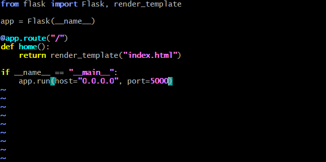
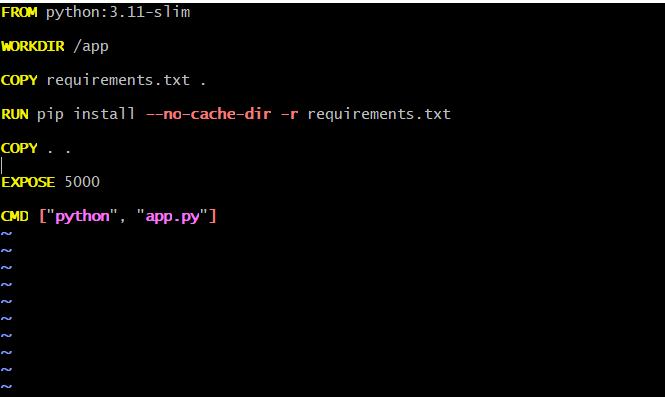
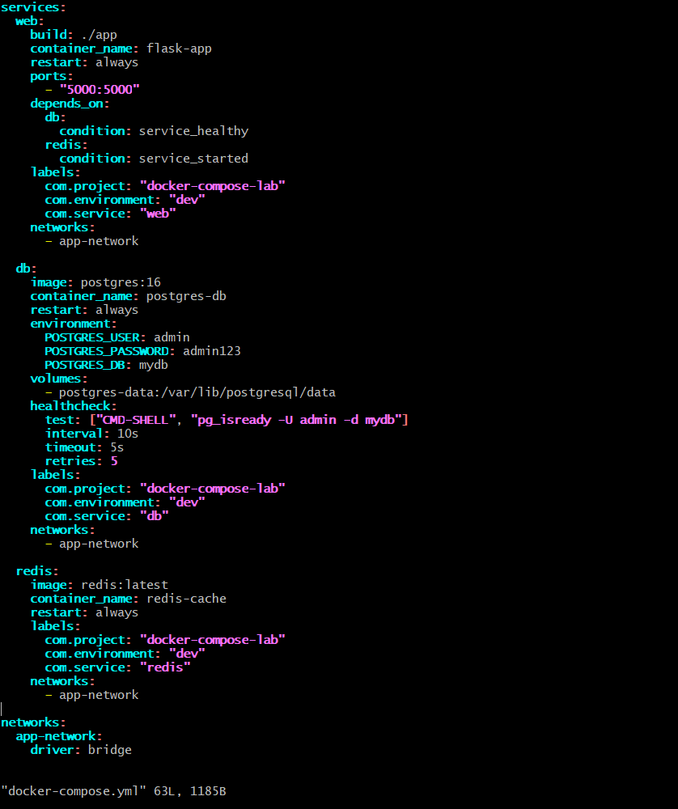

# Day 34 – Docker Compose: Real-World Multi-Container Apps

## Task

### Task 1: Build Your Own App Stack

- app.py



- Dockerfile




- Docker-compose file




### Task 2: depends_on & Healthchecks

- Added in compose file[depends_on, healthcheck]

### Task 3: Restart Policies

- Added in compose file[restart: always, restart: on-failure]

2. Manually kill the database container — does it come back?

Yes. After configuring restart: always, I killed the PostgreSQL container, and Docker automatically restarted it within a few seconds.

4. Write in your notes: When would you use each restart policy?

When to use each restart policy?

- always → For critical services like databases and web applications.
- on-failure → For applications that should restart only when they crash.
- unless-stopped → For long-running services that should restart unless manually stopped.
- no → For testing or one-time containers where auto-restart is not needed.

### Task 4: Custom Dockerfiles in Compose

- docker compose up -d --build

Task 5: Named Networks & Volumes

1. create your own network:
```text
networks:
  app-network:
    driver: bridge
```

2. Define Named Volume

```text
volumes:
  - postgres-data:/var/lib/postgresql/data
```

3. Add Labels
```text
labels:
  com.project: "docker-compose-lab"
  com.environment: "dev"
  com.owner: "raktim"
```

- docker network ls
- docker volume ls
- docker inspect flask-app[check lables]

### Task 5: Named Networks & Volumes

- Added in compose file[explicit networks, named volumes, labels]

### Task 6: Scaling (Bonus)

1. Scale the Web App to 3 Replicas

```text
docker compose up -d --scale web=3
```

2. What Happens? What Breaks?

Docker Compose creates 3 web containers:
```text
flask-app-1
flask-app-2
flask-app-3
```
However, if your compose file contains:
```text
ports:
  - "5000:5000"
```
only one container can bind to host port 5000.

The other replicas fail with a port conflict because:
```text
Host Port 5000
      ↓
Can only be used by one container
```
You may see errors like:
```text
Bind for 0.0.0.0:5000 failed: port is already allocated
```

3. Why Doesn't Simple Scaling Work with Port Mapping?

Simple scaling doesn't work because all replicas try to expose the same host port. A host port can only be assigned to one container at a time, causing port conflicts when multiple replicas are created.

In real-world environments, scaling is usually combined with a load balancer (Nginx, HAProxy, Traefik, Kubernetes Service, etc.):
```text
Users
   ↓
Load Balancer
   ↓
Web-1
Web-2
Web-3
```
This allows traffic to be distributed across multiple application instances without exposing the same host port multiple times.