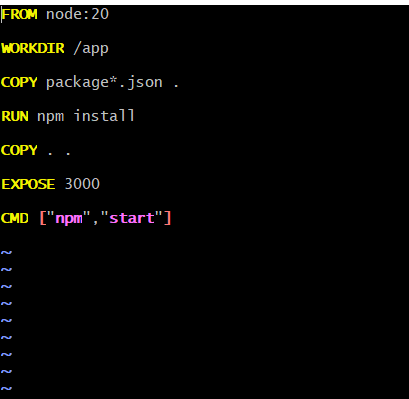
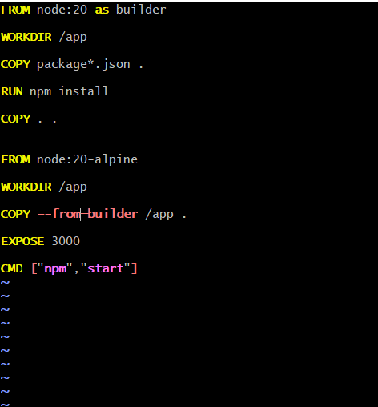
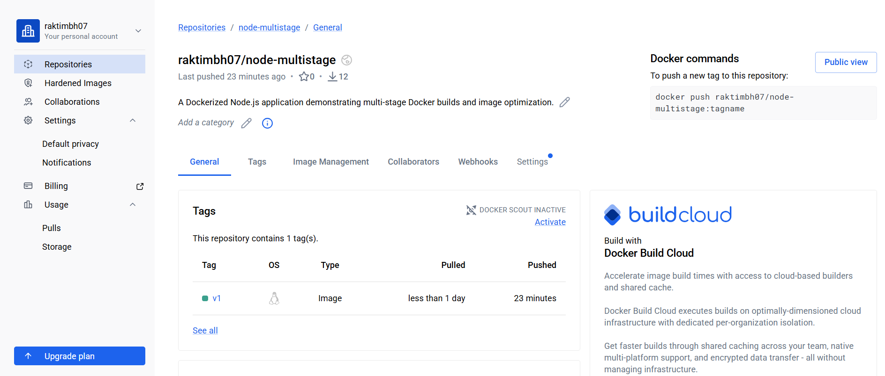

# Day 35 – Multi-Stage Builds & Docker Hub

## Task

### Task 1: The Problem with Large Images



### Task 2: Multi-Stage Build




### Task 3: Push to Docker Hub

## Run From The Terminal
```text
# Login
docker login

# View local images
docker images

# Tag image
docker tag node-multistage raktimbhuiya/node-multistage:v1

# Push image
docker push raktimbhuiya/node-multistage:v1

# Remove local image
docker rmi raktimbhuiya/node-multistage:v1
docker rmi node-multistage

# Pull from Docker Hub
docker pull raktimbhuiya/node-multistage:v1

# Run the container
docker run -d -p 3000:3000 raktimbhuiya/node-multistage:v1
```

### Task 4: Docker Hub Repository



4. Pull a specific tag vs `latest` — what happen?

Pull a specific version
```text
docker pull raktimbhuiya/node-multistage:v1
```
Docker downloads only version v1.

Pull the latest version
```text
docker pull raktimbhuiya/node-multistage:latest
```
Docker downloads the image tagged as latest.

## What happens?

Suppose Docker Hub contains:
```text
v1
v2
v3
latest → points to v3
```
Then:
```text
docker pull raktimbhuiya/node-multistage:v1
```
⬇️ Downloads v1

Whereas:
```text
docker pull raktimbhuiya/node-multistage:latest
```
⬇️ Downloads v3 (because latest currently points to v3)

**Important**: latest is not automatically the newest image. It's simply the image that has been explicitly tagged as latest.

### Task 5: Image Best Practices

2. 
```text
FROM node:20-alpine

WORKDIR /app

COPY package*.json ./

RUN npm install --omit=dev

COPY . .

RUN addgroup -S appgroup && \
    adduser -S appuser -G appgroup

USER appuser

EXPOSE 3000

CMD ["npm","start"]
```